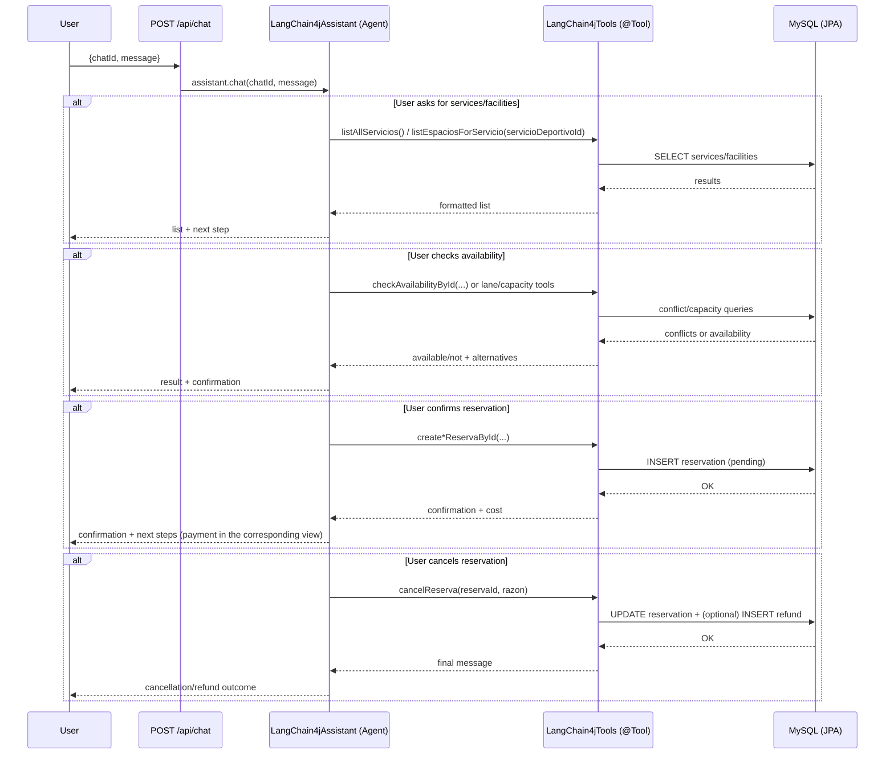
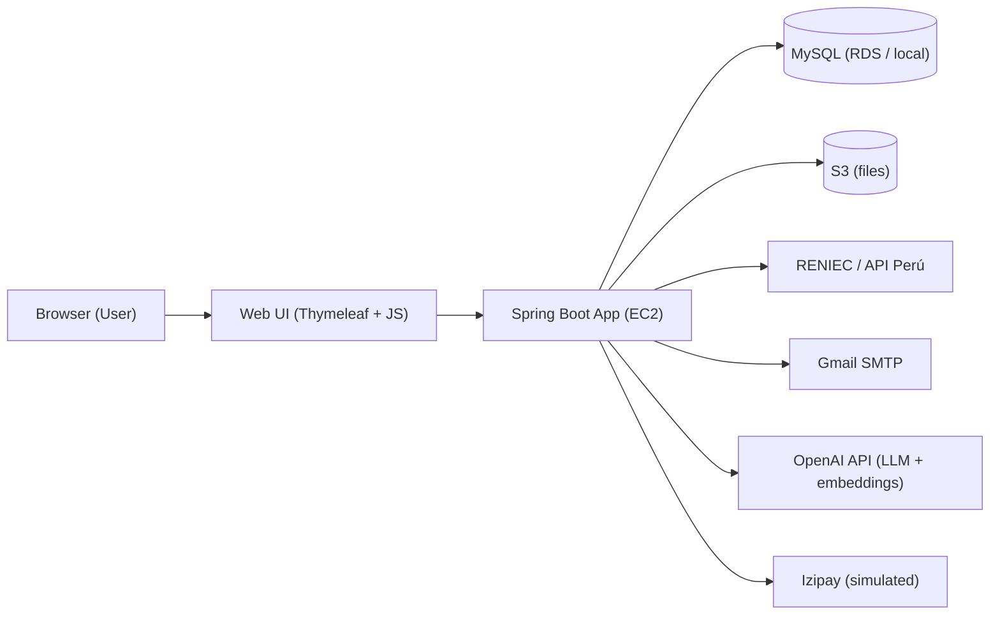

# Sports Facility Management System — Municipality of San Miguel (TeleLinkPUCP)

[](https://www.oracle.com/java/)
[](https://spring.io/projects/spring-boot)
[](https://www.mysql.com/)
[](https://aws.amazon.com/)
[](https://github.com/langchain4j/langchain4j)

Web application for **sports facility reservations** (residents) and **administration/monitoring** (admin, coordinator, superadmin). It includes an **LLM chatbot (SanMI Bot)** integrated with **LangChain4j** for queries and assisted operations via *tool-calling*.

- **Author (fork):** Gianfranco Enriquez (@GianES26)
- **Fork:** https://github.com/GianES26/TeleLinkPUCP.git
- **Demo:** pending
- **README (ES):** `readme.md`  |  **README (EN):** `readme.en.md`

---

## TL;DR

- **Spring Boot backend (Java 17)** with MVC + JPA + role-based security.
- **MySQL** persistence (local or AWS RDS).
- Cloud-friendly architecture documented with **AWS EC2 / RDS / S3**.
- **SanMI Bot (LangChain4j)**: Agent with explicit rules + Tools (`@Tool`) that execute real operations (queries, reservations, cancellations and refunds).
- Highlighted contribution: design/implementation of the **`langchain4j/`** module (agentic tool-calling + business validations + “RAG ready”).

---

## 1. Chatbot Architecture (LangChain4j) — highlighted contribution

**SanMI Bot** implements the **Agent + Tools** pattern:

- The **Agent** interprets intent, applies UX/validation rules, and decides which tool to call.
- The **Tools** read/write real system state via JPA repositories and `HttpSession`, reducing hallucinations (the DB is the source of truth).

### 1.1 Agent design (System Prompt / rules)

File:
- `Springboot-app/src/main/java/com/example/telelink/langchain4j/LangChain4jAssistant.java`

Verifiable characteristics:
- Persona and context (SanMI Bot; Spanish; current date `{{current_date}}`).
- Strict scope (only sports reservations / facility management).
- UX rules: guide users by **name + facility**, avoiding asking users for IDs.
- Strong validation: `YYYY-MM-DD HH:mm` format, future dates, business hours.
- Consistent cancellation/refund policy (48h rule, payment method).

### 1.2 HTTP integration (chat endpoint)

File:
- `Springboot-app/src/main/java/com/example/telelink/controller/ChatController.java`

Endpoint:
- `POST /api/chat` with `{ chatId, message }` → `assistant.chat(chatId, message)`

### 1.3 Conversational memory and RAG (Terms of Service)

Files:
- `Springboot-app/src/main/java/com/example/telelink/langchain4j/LangChain4jConfig.java`
- `Springboot-app/src/main/java/com/example/telelink/langchain4j/DocumentationIngestor.java`
- `Springboot-app/src/main/resources/terms-of-service.txt`

What is implemented in code:
- **Memory** per `chatId` with a **10-message** window (`MessageWindowChatMemory.withMaxMessages(10)`).
- **“RAG ready”**: ingestion of `terms-of-service.txt` into an `InMemoryEmbeddingStore` and a configured `ContentRetriever` (`maxResults=2`, `minScore=0.6`).

> Note: this repository prepares the retrieval component (ingestion + retriever). If you want cited sources and stronger grounding, you can extend the assistant pipeline with retrieval augmentation.

### 1.4 Tools catalog (complete, based on `@Tool`)

File:
- `Springboot-app/src/main/java/com/example/telelink/langchain4j/LangChain4jTools.java`

The tools (`@Tool`) are connected to:
- `HttpSession` (authenticated user context).
- JPA repositories (services, facilities, reservations, payments, refunds).

Complete table (methods + `@P` params, rules and effects):

| Tool (exact method) | Description (`@Tool`) | Parameters (`@P`) | Relevant validations / rules | Output |
|---|---|---|---|---|
| `listAllServicios()` | Lists all available court types, showing their ID. | — | In the current implementation, it lists services whose name starts with `"Cancha"`. | `String` with HTML (`<br>`, `<strong>`) + guidance text. |
| `listEspaciosForServicio(Integer servicioDeportivoId)` | Lists all available sports facilities for a given court type, showing their ID. | `servicioDeportivoId` | Filters facilities with `estadoServicio == operativo`. | HTML detailed list (ID, name, venue, location, price/hour, schedule). |
| `countEspaciosForServicio(String servicioDeportivo)` | Counts how many facilities exist for a given court type. | `servicioDeportivo` | Normalizes inputs (grass/loza/basketball/volleyball/multipropurpose). May ask for disambiguation if input is “Soccer”. | Text with count + follow-up question. |
| `checkAvailabilityById(Integer espacioId, String start, String end)` | Checks if a specific facility is available for a time range using its ID. | `espacioId`, `start`, `end` | Parses `yyyy-MM-dd HH:mm`; future; `end > start`; within schedule; conflicts in DB (confirmed/completed). Suggests alternatives within the same service on conflicts. | Available/not + conflicts + alternatives + calculated cost. |
| `createReservaById(Integer espacioId, String start, String end)` | Creates a reservation for a specific facility using its ID. | `espacioId`, `start`, `end` | Requires session; future; `end > start`; within schedule; no conflicts. Creates reservation as `pendiente`. | Confirmation + cost (includes internal reservation ID). |
| `listUserConfirmedFutureReservas()` | Lists the user’s confirmed reservations (now → +1 month). Useful for canceling. | — | Requires session; filters time range; status `confirmada`. | HTML list of upcoming reservations + cancellation UX instructions. |
| `cancelReserva(Integer reservaId, String razonCancelacion)` | Cancels a reservation (optional reason; default “Cancelado por Chatbot”). | `reservaId`, `razonCancelacion` | Requires session; reservation must belong to user; 48h refund rule. If paid: online → auto refund; deposit → pending admin approval. | Final message (cancellation + refund status if applicable). |
| `checkPiscinaAvailabilityById(Integer espacioId, String start, String end, Integer numeroCarrilPiscina, Integer numeroParticipantes)` | Checks pool availability by lane and participants, with alternatives. | `espacioId`, `start`, `end`, `numeroCarrilPiscina`, `numeroParticipantes` | Service must be `"piscina"`; valid lane; valid participants; lane capacity based on participant counts; suggests alternatives. | Available/not + conflicts + alternatives + cost. |
| `checkAtletismoAvailabilityById(Integer espacioId, String start, String end, Integer numeroCarrilPista, Integer numeroParticipantes)` | Checks track availability by lane and participants, with alternatives. | `espacioId`, `start`, `end`, `numeroCarrilPista`, `numeroParticipantes` | Service `"pista de atletismo"`; valid lane/participants; lane capacity; suggests alternatives. | Available/not + conflicts + alternatives + cost. |
| `checkGimnasioAvailabilityById(Integer espacioId, String start, String end, Integer numeroParticipantes)` | Checks gym availability by capacity, with alternatives. | `espacioId`, `start`, `end`, `numeroParticipantes` | Service `"gimnasio"`; participants `1..capacity`; sums participants in active reservations; suggests alternatives. | Available/not + conflicts + alternatives + cost. |
| `createGimnasioReservaById(Integer espacioId, String start, String end, Integer numeroParticipantes)` | Creates a gym reservation with participants. | `espacioId`, `start`, `end`, `numeroParticipantes` | Requires session; validates capacity; creates `pendiente`. | Confirmation + cost (multiplies by participants). |
| `createAtletismoReservaById(Integer espacioId, String start, String end, Integer numeroCarrilPista, Integer numeroParticipantes)` | Creates a track reservation with lane and participants. | `espacioId`, `start`, `end`, `numeroCarrilPista`, `numeroParticipantes` | Requires session; validates lane/capacity; creates `pendiente`. | Confirmation + cost. |
| `createPiscinaReservaById(Integer espacioId, String start, String end, Integer numeroCarrilPiscina, Integer numeroParticipantes)` | Creates a pool reservation with lane and participants. | `espacioId`, `start`, `end`, `numeroCarrilPiscina`, `numeroParticipantes` | Requires session; validates lane/capacity; creates `pendiente`. | Confirmation + cost. |
| `getUserInfo()` | Gets the logged-in user’s personal info (profile). | — | Requires session. Returns PII (DNI/phone/email if present). | HTML with user data. |
| `getUserName()` | Gets only the logged-in user’s full name. | — | Requires session. | Text (full name or “not available”). |
| `getUserEmail()` | Gets only the logged-in user’s email. | — | Requires session. | Text (email or “not available”). |

### 1.5 Conversational flow (tool-calling end-to-end)



### 1.6 Design notes (AI/Cloud/DevOps oriented)

- I chose **Agent + Tools** to separate *conversation* (LLM) from *verifiable execution* (tools + DB).
- Reduced hallucinations: availability/reservation/cancellation are determined by **tool-calling** (source of truth).
- Authenticated state: `HttpSession` ensures sensitive operations act for the **logged-in user**.
- Input validation in tools: future dates, `end > start`, business hours, capacity (lane/occupancy/participants).
- Observability (recommended): instrument tool latency, failure rates, traceability by `chatId`.
- Security (recommended): rate limiting for the endpoint, action auditing (create/cancel), log redaction (PII).

---

## 2. Project Overview

### 2.1 Objective

Build a web application for **efficient sports reservation management** at a district level, including internal modules for administration, operation validation, reporting, and monitoring.

### 2.2 Scope

The system covers:
- End-user experience: availability, booking, payments, and cancellations.
- Internal operations: dashboards, validations, and role-based monitoring.
- External integrations: DNI validation, email notifications, simulated payment gateway, and conversational AI.

---

## 3. Project Links

- **Project management (JIRA):** https://gticsv1proyecto.atlassian.net/jira/software/projects/TL/boards/35
- **Video evidence (Drive, in Spanish):** https://drive.google.com/drive/folders/1jGNVeG2lRFHc-shw35mM-pYoXiiBUAYv?usp=sharing

---

## 4. Roles and Credentials (demo)

| Role | User | Password |
|-----|---------|------------|
| **Superadmin** | superadmin@gtics.com | 123 |
| **Admin** | admin.sofia@gtics.com | 123 |
| **Resident** | maria.gomez@gtics.com | 123 |
| **Coordinator** | coord.laura@gtics.com | 123 |

---

## 5. Platform Architecture (AWS + components)


Architecture designed for AWS deployment, with:
- **EC2** running Spring Boot (embedded Tomcat).
- **RDS (MySQL)** as the database.
- **S3** for file storage.
- Integrations with **RENIEC/API Perú**, **Gmail SMTP**, **OpenAI**, and **Izipay (simulated)**.

### Diagram (high level)



---

## 6. Tech Stack

### Backend

- Java 17, Spring Boot 3.x
- Spring Security, Spring Data JPA
- Thymeleaf, Maven
- LangChain4j (Spring Boot Starter + OpenAI Starter)

### Frontend

- HTML5 / CSS3 / JavaScript
- Bootstrap 5, FullCalendar, ApexCharts

### Database

- MySQL 8.0

### Cloud & DevOps (documented architecture)

- AWS EC2, RDS, S3

---

## 7. Web Services

### 7.1 API Perú - DNI data lookup

**Endpoint:** `https://apiperu.dev/api/dni/{dni}` — **Method:** `POST`

### 7.2 OpenAI - Chat Completions

**Endpoint:** `https://api.openai.com/v1/chat/completions` — **Method:** `POST`

Characteristics:
- **LangChain4j** orchestration
- Tool-calling for backend operations
- Spanish, validations, and conversational policy

### 7.3 Gmail SMTP

Server: `smtp.gmail.com` — Port: `587` (STARTTLS)

### 7.4 Izipay (simulated)

Simulated payment gateway flows for the academic project.

---

## 8. Installation, Environment Variables, and Configuration

### Prerequisites

- Java 17+
- Maven 3.6+ (or use Maven Wrapper)
- MySQL 8.0+
- API keys/tokens (OpenAI, API Perú)

### Local setup

1) Clone the repository (fork)

```bash
git clone https://github.com/GianES26/TeleLinkPUCP.git
cd TeleLinkPUCP/Springboot-app
```

2) Set up the database

```bash
mysql -u root -p < ../MySQL/DB_GTICS.sql
```

3) Environment variables (example)

```bash
export SPRING_PROFILES_ACTIVE=local

export DB_HOST=localhost
export DB_NAME=deportes_san_miguel
export DB_USER=tu_usuario
export DB_PASSWORD=tu_password

export OPENAI_API_KEY=tu_openai_key
export APIPERU_TOKEN=tu_api_peru_token

export EMAIL_USERNAME=tu_email@gmail.com
export EMAIL_PASSWORD=tu_app_password
```

4) Run

```bash
./mvnw spring-boot:run
```

5) Open

- http://localhost:8080

---

## 9. Project structure

```text
TeleLinkPUCP/
├── Springboot-app/                  # Spring Boot application
│   ├── src/main/java/com/example/telelink/
│   │   ├── controller/              # MVC controllers (incl. ChatController)
│   │   ├── entity/                  # JPA entities
│   │   ├── repository/              # Repositories
│   │   ├── service/                 # Business services
│   │   ├── langchain4j/             # LangChain4j Agent + Tools + RAG ready
│   │   └── config/                  # Configuration
│   └── src/main/resources/
│       ├── static/                  # CSS/JS/images
│       ├── templates/               # Thymeleaf
│       └── terms-of-service.txt     # Document for RAG
├── MySQL/                           # SQL scripts
└── readme.md
```

---

## 10. Key features (by role)

### Resident

- Registration with automatic DNI validation
- Facility availability checks
- Facility reservations
- Online payment / deposit
- Cancellation with refund policy
- SanMI Bot chatbot (conversational assistance)

### Coordinator

- Attendance tracking with geolocation
- Operational dashboard (assigned duties/activities)
- Reports

### Admin

- User and role management
- Sports facilities management
- Deposit payment validation
- Reservation/operations dashboards

### Superadmin

- Full system control
- Advanced admin and configuration management

---

## 11. How to test the chatbot (suggested prompts)

1) “Hola”
2) “Lista espacios deportivos para Cancha de Fútbol Loza”
3) “Consultar disponibilidad para Gimnasio Central el 2025-07-10 de 18:00 a 20:00”
4) “Consultar disponibilidad para Piscina Olímpica, carril 2, para 3 personas el 2025-07-10 de 18:00 a 20:00”
5) “Reservar la Cancha Multipropósito el 2025-07-10 de 18:00 a 20:00”
6) “¿Cuáles son mis reservas futuras confirmadas?”
7) “Cancelar mi reserva para [espacio] en [establecimiento] el [fecha] de [hora] a [hora]”

---

## 12. Security (summary)

- Session-based authentication
- Role-based authorization (RBAC)
- CSRF protection
- Input validation
- Password hashing (BCrypt)
- API keys/secrets via environment variables

---

## 13. Production considerations

If productizing this Agent+Tools pattern:

- **Observability**: structured logs by `chatId`, tool-level latency metrics, success/failure counters.
- **Security**: rate limiting for `POST /api/chat`, action auditing (create/cancel/refund), log sanitization (avoid PII).
- **RAG with citations**: retrieval with cited sources (TOS/FAQ) and versioned policies.
- **CI/CD**: build/test pipeline + dependency scanning + deployment.
- **Containers**: Dockerfile and per-environment profiles for reproducible deployment.

---

## 14. Credits and contribution

- Academic project: **GTICS 2025-I (PUCP)**
- Personal contribution — **Gianfranco Enriquez (@GianES26)**:
  - Role-based feature development (operational modules, flows, CRUDs).
  - **LangChain4j** integration design and implementation:
    - Agent: `LangChain4jAssistant.java`
    - Tools: `LangChain4jTools.java`
    - RAG ready: ingestion + retriever over `terms-of-service.txt`

---

## 15. Application evidence

- Videos (in Spanish): https://drive.google.com/drive/folders/1jGNVeG2lRFHc-shw35mM-pYoXiiBUAYv?usp=sharing
