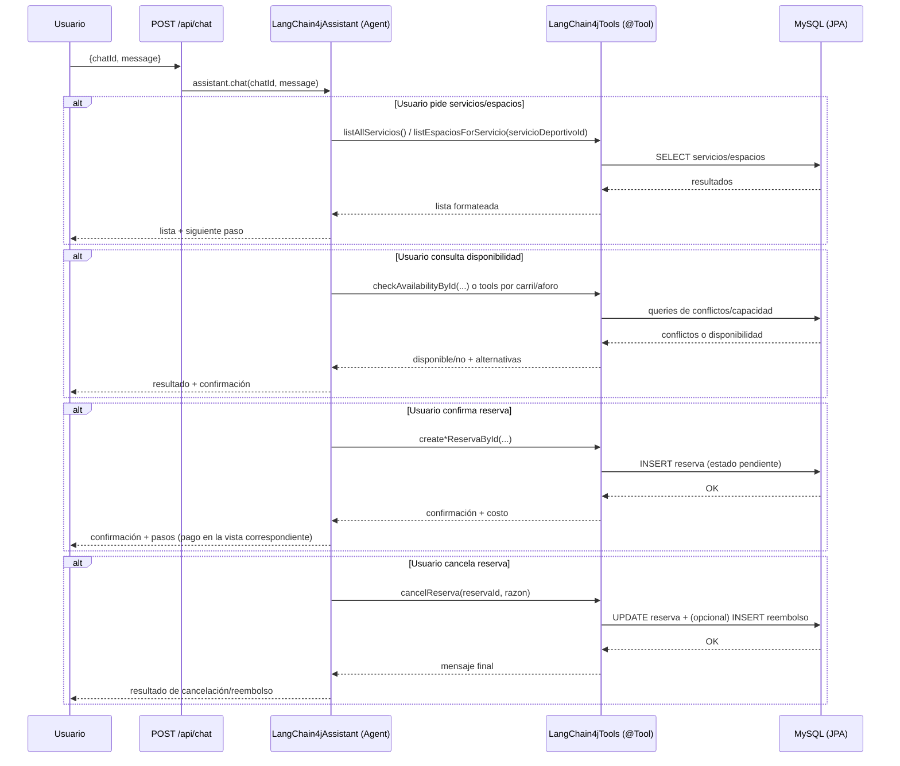
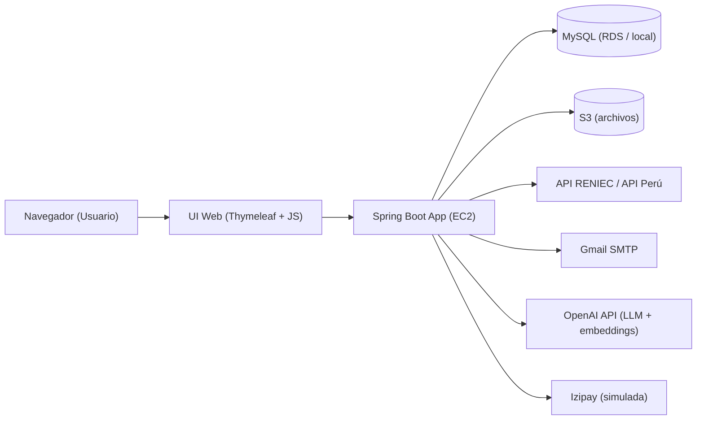

# Sistema de Gestión Deportiva — Municipalidad de San Miguel (TeleLinkPUCP)

[](https://www.oracle.com/java/)
[](https://spring.io/projects/spring-boot)
[](https://www.mysql.com/)
[](https://aws.amazon.com/)
[](https://github.com/langchain4j/langchain4j)

Aplicación web para **gestión de reservas** de espacios deportivos (vecinos) y **administración/monitoreo** (administrador, coordinador, superadmin). Incluye un **chatbot LLM (SanMI Bot)** integrado con **LangChain4j** para consultas y operaciones asistidas mediante *tool-calling*.

- **Autor (fork):** Gianfranco Enriquez (@GianES26)
- **Fork:** https://github.com/GianES26/TeleLinkPUCP.git
- **Demo:** pendiente
- **README (ES):** `readme.md`  |  **README (EN):** `readme.en.md`

---

## TL;DR

- Backend **Spring Boot (Java 17)** con MVC + JPA + seguridad por roles.
- Persistencia en **MySQL** (local o AWS RDS).
- Arquitectura cloud-friendly documentada con **AWS EC2 / RDS / S3**.
- **SanMI Bot (LangChain4j)**: Agent con reglas explícitas + Tools (`@Tool`) que ejecutan operaciones reales (consultas, reservas, cancelación y reembolso).
- Contribución destacada: diseño/implementación del módulo **`langchain4j/`** (agentic tool-calling + validaciones de negocio + RAG “ready”).

---

## 1. Arquitectura del Chatbot (LangChain4j) — Mi contribución

**SanMI Bot** implementa el patrón **Agent + Tools**:

- El **Agent** interpreta intención, aplica reglas de UX/validación y decide qué tool ejecutar.
- Las **Tools** consultan/actualizan el estado real del sistema vía repositorios JPA y `HttpSession`, generando consistencia entre las consultas del usuario y las respuestas del Chatbot.

### 1.1 Diseño del agente (System Prompt / reglas)

Archivo:
- `Springboot-app/src/main/java/com/example/telelink/langchain4j/LangChain4jAssistant.java`

Características verificables del diseño:
- Persona y contexto (SanMI Bot; español; fecha actual `{{current_date}}`).
- Scope estricto (solo reservas/gestión de espacios deportivos).
- Reglas de UX: guiar al usuario por **nombre + establecimiento**, evitando pedir IDs al usuario.
- Validación fuerte: formato `YYYY-MM-DD HH:mm`, fechas futuras, horario de atención.
- Política de cancelación/reembolso consistente (regla 48h, método de pago).

### 1.2 Integración HTTP (chat endpoint)

Archivo:
- `Springboot-app/src/main/java/com/example/telelink/controller/ChatController.java`

Endpoint:
- `POST /api/chat` con `{ chatId, message }` → `assistant.chat(chatId, message)`

### 1.3 Memoria conversacional y RAG (Términos de Servicio)

Archivos:
- `Springboot-app/src/main/java/com/example/telelink/langchain4j/LangChain4jConfig.java`
- `Springboot-app/src/main/java/com/example/telelink/langchain4j/DocumentationIngestor.java`
- `Springboot-app/src/main/resources/terms-of-service.txt`

Qué está implementado en código:
- **Memoria** por `chatId` con ventana de **10 mensajes** (`MessageWindowChatMemory.withMaxMessages(10)`).
- **RAG “ready”**: ingesta de `terms-of-service.txt` a un `InMemoryEmbeddingStore` y `ContentRetriever` configurado (`maxResults=2`, `minScore=0.6`).


### 1.4 Catálogo de Tools

Archivo:
- `Springboot-app/src/main/java/com/example/telelink/langchain4j/LangChain4jTools.java`

Las tools (`@Tool`) están conectadas a:
- `HttpSession` (usuario autenticado).
- Repositorios JPA (servicios, espacios, reservas, pagos, reembolsos).

Tabla completa (métodos + parámetros `@P`, reglas y efectos):

| Tool (método exacto) | Descripción (`@Tool`) | Parámetros (`@P`) | Validaciones / reglas relevantes | Output |
|---|---|---|---|---|
| `listAllServicios()` | Lista todos los tipos de canchas disponibles, mostrando su ID. | — | En su implementación actual, lista servicios cuyo nombre empieza con `"Cancha"`. | `String` como texto guía. |
| `listEspaciosForServicio(Integer servicioDeportivoId)` | Lista todos los espacios deportivos disponibles para un tipo de cancha, mostrando su ID. | `servicioDeportivoId` | Filtra espacios `estadoServicio == operativo`. | HTML con lista detallada (ID, nombre, establecimiento, ubicación, precio/hora, horario). |
| `countEspaciosForServicio(String servicioDeportivo)` | Cuenta cuántos espacios deportivos existen para un tipo de cancha. | `servicioDeportivo` | Normaliza entradas (grass/loza/básquet/vóley/multipropósito). Puede pedir desambiguación si el input es “Fútbol”. | Texto con conteo + pregunta de seguimiento. |
| `checkAvailabilityById(Integer espacioId, String start, String end)` | Verifica si un espacio deportivo específico está disponible para un rango de tiempo usando su ID. | `espacioId`, `start`, `end` | Parse `yyyy-MM-dd HH:mm`; futuro; `end > start`; dentro de horario; conflictos en BD (confirmada/completada). Sugiere alternativas del mismo servicio si hay conflicto. | Disponible/no + conflictos + alternativas + costo calculado. |
| `createReservaById(Integer espacioId, String start, String end)` | Crea una reserva para un espacio deportivo específico usando su ID. | `espacioId`, `start`, `end` | Requiere sesión; futuro; `end > start`; dentro de horario; sin conflictos. Crea reserva en estado `pendiente`. | Confirmación + costo (incluye ID interno de reserva). |
| `listUserConfirmedFutureReservas()` | Lista reservas confirmadas del usuario (ahora → +1 mes). Útil para cancelar. | — | Requiere sesión; filtra rango temporal; estado `confirmada`. | HTML con lista de reservas próximas + instrucción de UX para cancelar. |
| `cancelReserva(Integer reservaId, String razonCancelacion)` | Cancela una reserva (razón opcional; default “Cancelado por Chatbot”). | `reservaId`, `razonCancelacion` | Requiere sesión; la reserva debe pertenecer al usuario; regla 48h para reembolso. Si hay pago: online → reembolso automático; depósito → pendiente admin. | Mensaje final (cancelación + estado de reembolso si aplica). |
| `checkPiscinaAvailabilityById(Integer espacioId, String start, String end, Integer numeroCarrilPiscina, Integer numeroParticipantes)` | Verifica disponibilidad de piscina por carril y participantes, con alternativas. | `espacioId`, `start`, `end`, `numeroCarrilPiscina`, `numeroParticipantes` | Servicio debe ser `"piscina"`; carril válido; participantes válidos; capacidad por carril por conteo de participantes; sugiere alternativas. | Disponible/no + conflictos + alternativas + costo. |
| `checkAtletismoAvailabilityById(Integer espacioId, String start, String end, Integer numeroCarrilPista, Integer numeroParticipantes)` | Verifica disponibilidad de pista por carril y participantes, con alternativas. | `espacioId`, `start`, `end`, `numeroCarrilPista`, `numeroParticipantes` | Servicio `"pista de atletismo"`; carril y participantes válidos; capacidad por carril; sugiere alternativas. | Disponible/no + conflictos + alternativas + costo. |
| `checkGimnasioAvailabilityById(Integer espacioId, String start, String end, Integer numeroParticipantes)` | Verifica disponibilidad de gimnasio por aforo, con alternativas. | `espacioId`, `start`, `end`, `numeroParticipantes` | Servicio `"gimnasio"`; participantes `1..aforo`; suma participantes en reservas activas; sugiere alternativas. | Disponible/no + conflictos + alternativas + costo. |
| `createGimnasioReservaById(Integer espacioId, String start, String end, Integer numeroParticipantes)` | Crea reserva para gimnasio con participantes. | `espacioId`, `start`, `end`, `numeroParticipantes` | Requiere sesión; valida aforo; crea `pendiente`. | Confirmación + costo (multiplica por participantes). |
| `createAtletismoReservaById(Integer espacioId, String start, String end, Integer numeroCarrilPista, Integer numeroParticipantes)` | Crea reserva para pista con carril y participantes. | `espacioId`, `start`, `end`, `numeroCarrilPista`, `numeroParticipantes` | Requiere sesión; valida carril/capacidad; crea `pendiente`. | Confirmación + costo. |
| `createPiscinaReservaById(Integer espacioId, String start, String end, Integer numeroCarrilPiscina, Integer numeroParticipantes)` | Crea reserva para piscina con carril y participantes. | `espacioId`, `start`, `end`, `numeroCarrilPiscina`, `numeroParticipantes` | Requiere sesión; valida carril/capacidad; crea `pendiente`. | Confirmación + costo. |
| `getUserInfo()` | Obtiene info personal del usuario logueado (perfil). | — | Requiere sesión. Devuelve PII (DNI/teléfono/correo si existen). | HTML con datos del usuario. |
| `getUserName()` | Obtiene solo el nombre completo del usuario logueado. | — | Requiere sesión. | Texto (nombre completo o “no disponible”). |
| `getUserEmail()` | Obtiene solo el correo del usuario logueado. | — | Requiere sesión. | Texto (correo o “no disponible”). |

### 1.5 Flujo conversacional (tool-calling end-to-end)



### 1.6 Notas de diseño

- Elegí **Agent + Tools** para separar *conversación* (LLM) de las tools y la BD.
- Reduzco alucinaciones: la disponibilidad/reserva/cancelación se determinan por **tool-calling** que consulta con la base de datos.
- Estado y autenticación: uso `HttpSession` para que las operaciones sensibles sean del **usuario logueado**.
- Validaciones de input en tools: fechas futuras, `end > start`, horario de operación, capacidad (carril/aforo/participantes).

---

## 2. Descripción General del Proyecto

### 2.1 Objetivo

Desarrollar una aplicación web para la **gestión eficiente de reservas** de canchas/servicios deportivos a nivel distrital, incorporando módulos internos para administración, validación de operaciones, generación de reportes y monitoreo.

### 2.2 Alcance

El sistema cubre:
- Experiencia de usuario final: disponibilidad, reserva, pagos y cancelaciones.
- Operación interna: dashboards, validaciones y seguimiento por roles.
- Integraciones externas: validación de DNI, notificaciones por correo, pasarela de pago simulada e IA conversacional.

---

## 3. Enlaces del Proyecto

- **Gestión del proyecto (JIRA):** https://gticsv1proyecto.atlassian.net/jira/software/projects/TL/boards/35
- **Evidencias en video (Drive, en español):** https://drive.google.com/drive/folders/1jGNVeG2lRFHc-shw35mM-pYoXiiBUAYv?usp=sharing

---

## 4. Roles y Credenciales (demo)

| Rol | Usuario | Contraseña |
|-----|---------|------------|
| **Superadmin** | superadmin@gtics.com | 123 |
| **Administrador** | admin.sofia@gtics.com | 123 |
| **Vecino** | maria.gomez@gtics.com | 123 |
| **Coordinador** | coord.laura@gtics.com | 123 |

---

## 5. Arquitectura de la Plataforma (AWS + componentes)


Arquitectura pensada para despliegue en AWS, con:
- **EC2** ejecutando Spring Boot (Tomcat embebido).
- **RDS (MySQL)** como base de datos.
- **S3** para almacenamiento de archivos.
- Integraciones con **RENIEC/API Perú**, **Gmail SMTP**, **OpenAI** e **Izipay (simulada)**.

### Diagrama (alto nivel)



---

## 6. Tecnologías Utilizadas

### Backend

- Java 17, Spring Boot 3.x
- Spring Security, Spring Data JPA
- Thymeleaf, Maven
- LangChain4j (Spring Boot Starter + OpenAI Starter)

### Frontend

- HTML5 / CSS3 / JavaScript
- Bootstrap 5, FullCalendar, ApexCharts

### Base de Datos

- MySQL 8.0

### Cloud & DevOps (arquitectura documentada)

- AWS EC2, RDS, S3

---

## 7. Servicios Web (Web Services)

### 7.1 API Perú - Consulta de Datos por DNI

**Endpoint:** `https://apiperu.dev/api/dni/{dni}` — **Método:** `POST`

### 7.2 OpenAI - Chat Completions

**Endpoint:** `https://api.openai.com/v1/chat/completions` — **Método:** `POST`

Características:
- Orquestación con **LangChain4j**
- Tool-calling para operaciones backend
- Español, validaciones y policy conversacional

### 7.3 Gmail SMTP

Servidor: `smtp.gmail.com` — Puerto: `587` (STARTTLS)

### 7.4 Izipay (simulada)

Flujos simulados de pasarela de pago para el proyecto académico.

---

## 8. Instalación, Variables y Configuración

### Prerrequisitos

- Java 17+
- Maven 3.6+ (o usar Maven Wrapper)
- MySQL 8.0+
- API keys/tokens (OpenAI, API Perú)

### Configuración local

1) Clonar el repositorio (fork)

```bash
git clone https://github.com/GianES26/TeleLinkPUCP.git
cd TeleLinkPUCP/Springboot-app
```

2) Configurar base de datos

```bash
mysql -u root -p < ../MySQL/DB_GTICS.sql
```

3) Variables de entorno (ejemplo)

```bash
export SPRING_PROFILES_ACTIVE=local

export DB_HOST=localhost
export DB_NAME=deportes_san_miguel
export DB_USER=tu_usuario
export DB_PASSWORD=tu_password

export OPENAI_API_KEY=tu_openai_key
export APIPERU_TOKEN=tu_api_peru_token

export EMAIL_USERNAME=tu_email@gmail.com
export EMAIL_PASSWORD=tu_app_password
```

4) Ejecutar

```bash
./mvnw spring-boot:run
```

5) Acceder

- http://localhost:8080

---

## 9. Estructura del proyecto

```text
TeleLinkPUCP/
├── Springboot-app/                  # Aplicación Spring Boot
│   ├── src/main/java/com/example/telelink/
│   │   ├── controller/              # Controladores MVC (incluye ChatController)
│   │   ├── entity/                  # Entidades JPA
│   │   ├── repository/              # Repositorios
│   │   ├── service/                 # Servicios de negocio
│   │   ├── langchain4j/             # LangChain4j Agent + Tools + RAG ready
│   │   └── config/                  # Configuración
│   └── src/main/resources/
│       ├── static/                  # CSS/JS/imágenes
│       ├── templates/               # Thymeleaf
│       └── terms-of-service.txt     # Documento para RAG
├── MySQL/                           # Scripts SQL
└── readme.md
```

---

## 10. Funcionalidades principales (por rol)

### Vecino

- Registro con validación automática de DNI
- Consulta de disponibilidad de espacios
- Reserva de espacios deportivos
- Pago online / depósito
- Cancelación con política de reembolso
- Chatbot SanMI Bot (asistencia conversacional)

### Coordinador

- Registro de asistencia con geolocalización
- Dashboard operacional (obligaciones/actividades asignadas)
- Reportes

### Administrador

- Gestión de usuarios y roles
- Administración de espacios deportivos
- Validación de pagos por depósito
- Dashboard/indicadores de reservas y operación

### Superadmin

- Control total del sistema
- Gestión avanzada de administradores y configuraciones

---

## 11. Cómo probar el chatbot (prompts sugeridos)

1) “Hola”
2) “Lista espacios deportivos para Cancha de Fútbol Loza”
3) “Consultar disponibilidad para Gimnasio Central el 2026-07-10 de 18:00 a 20:00”
4) “Consultar disponibilidad para Piscina Olímpica, carril 2, para 3 personas el 2026-07-10 de 18:00 a 20:00”
5) “Reservar la Cancha Multipropósito el 2026-07-10 de 18:00 a 20:00”
6) “¿Cuáles son mis reservas futuras confirmadas?”
7) “Cancelar mi reserva para [espacio] en [establecimiento] el [fecha] de [hora] a [hora]”

---

## 12. Seguridad (resumen)

- Autenticación basada en sesiones
- Autorización por roles (RBAC)
- Protección CSRF
- Validación de entrada de datos
- Encriptación de contraseñas (BCrypt)
- API Keys/secrets vía variables de entorno

---

## 13. Consideraciones para producción

Si se considera este patrón Agent+Tools:

- **Observabilidad**: logs estructurados por `chatId`, métricas de latencia por tool, contadores de éxito/fallo.
- **Seguridad**: rate limiting para `POST /api/chat`, auditoría de acciones (crear/cancelar/reembolsar).
- **RAG con citas**: retrieval con fuentes citadas (TOS/FAQ) y políticas versionadas.
- **CI/CD**: pipeline build/test + escaneo de dependencias + despliegue.
- **Contenedores**: Dockerfile y perfiles por entorno para despliegue reproducible.

---

## 14. Créditos y contribución

- Proyecto académico: **GTICS 2025-I (PUCP)**
- Contribución personal — **Gianfranco Enriquez Soel (@GianES26)**:
  - Desarrollo de funcionalidades del sistema por roles (módulos operativos, flujos y CRUDs).
  - Diseño e implementación de la integración **LangChain4j**:
    - Agent: `LangChain4jAssistant.java`
    - Tools: `LangChain4jTools.java`
    - RAG ready: ingesta + retriever sobre `terms-of-service.txt`

---

## 15. Evidencias del funcionamiento de la aplicación

- Videos (en español): https://drive.google.com/drive/folders/1jGNVeG2lRFHc-shw35mM-pYoXiiBUAYv?usp=sharing